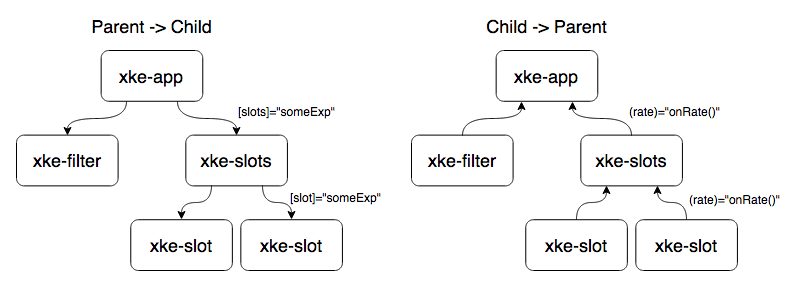

# Angular 2

> Alexandre Hebert [@dijxdream](https://twitter.com/dijxdream)
<br/>
> Dmytro Podyachiy [@dimapod79](https://twitter.com/dimapod79)
<br/>
> Djordje Lukic [@rumpl](https://twitter.com/rumpl)

---

# Introduction

> * Overview
> * Breaking changes

--

## Overview

--

### Motivations

* Performance accrue <!-- .element: class="fragment" data-fragment-index="1" -->
* Mobilité <!-- .element: class="fragment" data-fragment-index="2" -->
* Angular == Modular <!-- .element: class="fragment" data-fragment-index="3" -->

--

### Web Components

* Angular2 =&gt; WebComponents <!-- .element: class="fragment" data-fragment-index="1" -->
* WebComponents =&gt; Angular2 (ex: Polymer) <!-- .element: class="fragment" data-fragment-index="2" -->
* Support du Shadow DOM <!-- .element: class="fragment" data-fragment-index="3" -->

--

### Angular 2, enkoikçékodé ?


--

* AtScript ?
* TypeScript ? <!-- .element: class="fragment" data-fragment-index="1" -->
* EcmaScript 5, 6 ? <!-- .element: class="fragment" data-fragment-index="2" -->
* CoffeeScript ? <!-- .element: class="fragment" data-fragment-index="3" -->

--

### Type Script


--

### Angular 2, enkoikonkode ?

* TS            avec annotations <!-- .element: class="fragment" data-fragment-index="1" -->
* ES 6          avec décorateurs <!-- .element: class="fragment" data-fragment-index="1" -->
* ES 5          avec du courage <!-- .element: class="fragment" data-fragment-index="2" -->

N.B. : Traceur + SystemJs = Mandatory <!-- .element: class="fragment" data-fragment-index="1" -->

--

## Breaking changes

--

<!-- .element: data-background="image/angular2-effect.gif" -->

## The Angular 2 Effect

--

### Souvenez-vous...

--

#### Two-way data binding ?
 <!-- .element: class="fragment" data-fragment-index="1" -->

--

#### Controllers ?
 <!-- .element: class="fragment" data-fragment-index="1" -->

--

#### Well known directives (ng-*) ?
 <!-- .element: class="fragment" data-fragment-index="1" -->

--

#### Scopes / Root Scope ?
 <!-- .element: class="fragment" data-fragment-index="1" -->

--

#### $watch / $observe / $apply / $digest ?
 <!-- .element: class="fragment" data-fragment-index="1" -->

--

<!-- .element: data-background="image/oh-yeah.gif" -->

## Final Angular 2 Effect

--

### Production ready ?

Pas encore ! <!-- .element: class="fragment" data-fragment-index="1" -->

> Version courante : <br />2.0.0-alpha.26 Developer Preview <!-- .element: class="fragment" data-fragment-index="1" -->

--

### Compatibilité

* Navigateurs modernes
* IE 7, 8 ne sont plus supportés
* IE 9 supporté (avec Polyfills)

---

# Components

> Pierre angulaire de l’application <br> 
> Angular 2

* API bien definis
* le cycle de vie bien definis
* auto-descriptives

--

## Arborescence des composants


--

## @Component

Decorator

```typescript
@Component({
  selector: 'my-component'
})
class MyComponent {

}
```

Html

```html
<div id="content">
  <my-component></my-component>
</div>
```

--

## @View (1/3)

Inline

```typescript
@Component({
  selector: 'my-component'
})
@View({
  template: "<span>Hello {{message}} !</span>"
})
class MyComponent {
   constructor() {
      this.message = 'World';
   }
}
```

--

## @View (2/3)

Inline multi-ligne

```typescript
@Component({
  selector: 'my-component'
})
@View({
   template: `
      <span>
         Hello {{mssage}} !
      </span>
   `
})
class MyComponent {
   constructor() {
      this.message = 'World';
   }
}
```

--

## @View (3/3)

Template 

```typescript
@Component({
  selector: 'my-component'
})
@View({
   templateUrl: 'cmp.html'
})
class MyComponent {
   constructor() {
      this.message = 'World';
   }
}
```

cmp.html
```html
<span>Hello {{message}} !</span>
```

--

<h2>Properties</h2>

Html
<pre><code class="html hljs "><input type="text" value="foo"></code></pre>

Node <!-- .element: class="fragment" data-fragment-index="1" -->

<pre><code class="yaml hljs ">input:
   ...
   type: "text"
   value: "foo"
   ...
</code></pre> <!-- .element: class="fragment" data-fragment-index="1" -->

--

<h2>Properties: []</h2>

Angular 1
<pre><code class="html hljs"></code></pre>

<pre><!-- .element: class="fragment" data-fragment-index="2" --><code class="html hljs"><div ng-hide="isHidden">Hidden if isHidden is true</div>
<my-component foo="{{something}}"></my-component></code></pre>

Angular 2 <!-- .element: class="fragment" data-fragment-index="1" -->
<pre><code class="html hljs "></code></pre>  <!-- .element: class="fragment" data-fragment-index="1" -->

<pre><!-- .element: class="fragment" data-fragment-index="2" --><code class="html hljs"><div [hidden]="isHidden">Hidden if isHidden is true</div>
<my-component [foo]="something"></my-component></code></pre>

--

## Properties

> Input API

```typescript
@Component({
   selector: 'my-component',
   properties: {                  // <-- declaration des propriétés 
       model: 'model'
   }
})
class MyComponent {
   show() {
      console.log('model', this.model);
   }
}
```

Utilisation
```html
<my-component [model]=”data”></my-component>

```

--

<h2>Events: ()</h2>

Angular 1
<pre><code class="html hljs"><my-component select="myFunction()"></my-component></code></pre>

<pre><!-- .element: class="fragment" data-fragment-index="2" --><code class="html hljs"><div ng-click="doSomething()"></div></code></pre>

Angular 2 <!-- .element: class="fragment" data-fragment-index="1" -->
<pre><code class="html hljs "><my-component (select)="myFunction()"></my-component></code></pre>  <!-- .element: class="fragment" data-fragment-index="1" -->

<pre><!-- .element: class="fragment" data-fragment-index="3" --><code class="html hljs"><div (click)="doSomething()"></div></code></pre>

--

## Events

> Output API

```typescript
@Component({
   selector: 'my-component',
   events: ['event']              // <-- declaration des événements 
})
class MyComponent {
   event:EventEmitter = new EventEmitter();

   fireMyEvent(data:string) {
      this.event.next({value: data});
   }
}
```

Utilisation
```html
<my-component (event)=”myFunction()”></my-component>

```

--

## One way data binding

  <!-- .element: class="fragment" data-fragment-index="1" -->

Two-Way data-binding <!-- .element: class="fragment" data-fragment-index="1" -->

--

## Flux de données



> - Entrées via "bindings" des proprietés
> - Sorties via "bindings" des événements

--

## References: &#35;

```html
<input type="text" #user (keyup)>

{{user.value}}
<p (click)="user.focus()">
  Grab focus
</p>
```

--

## Host Element

```typescript
@Component({
  selector: 'trimmed-input',
  hostListeners:  {input: 'onChange($event.target.value)'},
  hostProperties: {value: 'value'}
})
class TrimmedInput {
  value: string;
  onChange(updatedValue: string) {
    this.value = updatedValue.trim();
  }
}
```

--

> Les components sont auto-descriptives

- savent interagir avec son "host" élément
- savent comment se representer
- configurent l’injection de dépendances
- ont des API public bien definis

---

# Prêt pour la bataille ?

---

# Workshop

> A vous de jouer !
