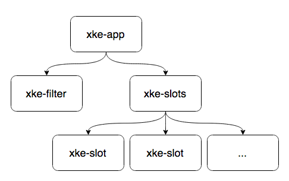

# Angular 2

> Alexandre Hebert [@dijxdream](https://twitter.com/dijxdream)
<br/>
> Dmytro Podyachiy [@dimapod79](https://twitter.com/dimapod79)
<br/>
> Djordje Lukic [@rumpl](https://twitter.com/rumpl)

---

# Introduction

* Plop
* Foo
* Zoom

---

# Components

> Pierre angulaire de l’application <br> 
> Angular 2

* API bien definis
* le cycle de vie bien definis
* auto-descriptives

--

## Arborescence des composants



--

## @Component

Decorator

```javascript
@Component({
  selector: 'my-component'
})
class MyComponent {

}
```

Html

```html
<div id="content">
  <my-component></my-component>
</div>
```

--

## @View (1/3)

```javascript
@Component({
  selector: 'my-component'
})
@View({
  template: "<span>Hello {{message}} !</span>"
})
class MyComponent {
   constructor() {
      this.message = 'World';
   }
}
```

--

## @View (2/3)

```javascript
@Component({
  selector: 'my-component'
})
@View({
   template: `
      <span>
         Hello {{message}} !
      </span>
   `
})
class MyComponent {
   constructor() {
      this.message = 'World';
   }
}
```

--

## @View (3/3)

```javascript
@Component({
  selector: 'my-component'
})
@View({
   templateUrl: 'cmp.html'
})
class MyComponent {
   constructor() {
      this.message = 'World';
   }
}
```

cmp.html
```html
<span>Hello {{message}} !</span>
```

--

## Properties: []

---

# Prêt pour la bataille ?

---

# Workshop

> A vous de jouer !
