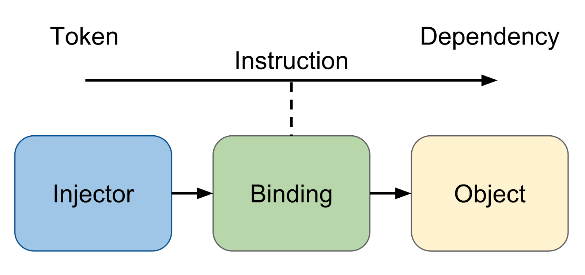

# Angular 2

> Alexandre Hebert [@dijxdream](https://twitter.com/dijxdream)
<br/>
> Dmytro Podyachiy [@dimapod79](https://twitter.com/dimapod79)
<br/>
> Djordje Lukic [@rumpl](https://twitter.com/rumpl)

---

# Introduction

> * Overview
> * Breaking changes

--

## Overview

<!-- taille du titre confondante avec ### -->

--

### Motivations

<!-- aller dans l'exagération en mettant plein de flèches et de termes partout, dans tous les sens, effet rictus 
mobile first = interface 
web components first = architecture applicative -->

* "Native way" <span class="fragment" data-fragment-index="1">: &nearr; performances</span>
* Expressif <span class="fragment" data-fragment-index="1">: &searr; boilerplate &nearr; productivité</span>
* "Mobile First" <span class="fragment" data-fragment-index="1">: &nearr; experience utilisateur</span>
* "WebComponents based" <span class="fragment" data-fragment-index="1">: &nearr; modularité</span>

> "The Changing Web", V. Georgiev

--

### Web Components

* Angular2 construit pour les WebComponents <!-- .element: class="fragment" data-fragment-index="1" -->
* WebComponents utilisables dans Angular2 (ex: Polymer) <!-- .element: class="fragment" data-fragment-index="2" -->
* Support du Shadow DOM <!-- .element: class="fragment" data-fragment-index="3" -->

--

### Angular 2, enkoikçékodé ?


--

* AtScript ?
* TypeScript ? <!-- .element: class="fragment" data-fragment-index="1" -->
* EcmaScript 5, 6 ? <!-- .element: class="fragment" data-fragment-index="2" -->
* CoffeeScript ? <!-- .element: class="fragment" data-fragment-index="3" -->

--

### Type Script


--

### Angular 2, enkoikonkode ?

* TS            avec annotations <!-- .element: class="fragment" data-fragment-index="1" -->
* ES 6          avec décorateurs <!-- .element: class="fragment" data-fragment-index="1" -->
* ES 5          avec du courage <!-- .element: class="fragment" data-fragment-index="2" -->

N.B. : Traceur + SystemJs = Mandatory <!-- .element: class="fragment" data-fragment-index="1" -->

--

## Breaking changes

--

<!-- .element: data-background="image/angular2-effect.gif" -->

## The First Angular 2 Effect

--

### Souvenez-vous...

--

<!-- reflechir à un pictogramme plus parlant, un gros fuck exagéré, a2sexg, i dont give a shit -->

#### Two-way data binding ?
 <!-- .element: class="fragment" data-fragment-index="1" -->

--

#### Controllers ?
 <!-- .element: class="fragment" data-fragment-index="1" -->

--

#### angular.module(... ?
 <!-- .element: class="fragment" data-fragment-index="1" -->

--

#### Scopes / Root Scope ?
 <!-- .element: class="fragment" data-fragment-index="1" -->

--

#### $watch / $observe / $apply / $digest ?
 <!-- .element: class="fragment" data-fragment-index="1" -->

--

#### Well known directives (ng-*) ?
 <!-- .element: class="fragment" data-fragment-index="1" -->

--

<!-- .element: data-background="image/oh-yeah.gif" -->

## Final Angular 2 Effect

--

### Compatibilité ?

* <span style="color: green">✓</span> Navigateurs modernes
* <span style="color: orange">&asymp;</span> IE 9 supporté (avec Polyfills)

--

### Quid d'IE 7 et 8 ?

✗ BYE BYE <!-- .element: class="fragment" style="color:red" data-fragment-index="1" -->

 <!-- .element: class="fragment" data-fragment-index="1" -->

--

### $ ./migration NG 1&gt;&amp;2 ?

Pas automatisable, mais anticipable !

> * <span style="color: red; text-decoration: line-through;">Controllers</span> / <span style="color: green">Directives</span>
> * Eviter l'usage de $scope
> * Basculer en TypeScript

--

### Production ready ?

Pas encore ! <!-- .element: class="fragment" data-fragment-index="1" -->

> Version courante : <br />2.0.0-alpha.27 Developer Preview <!-- .element: class="fragment" data-fragment-index="1" -->

--

### GET /angular/2/releaseDate

> 420 SOON - Fin 2015

---

# Components

> Pierre angulaire de l’application <br> Angular 2

* API definies précisement
* cycle de vie strict
* auto descriptifs

--

## Arborescence des composants


--

## @Component

Decorator

```typescript
@Component({
  selector: 'my-component'
})
class MyComponent {

}
```

Html

```html
<div id="content">
  <my-component></my-component>
</div>
```

--

## @View (1/3)

Inline

```typescript
@Component({
  selector: 'my-component'
})
@View({
  template: "<span>Hello {{message}} !</span>"
})
class MyComponent {
   constructor() {
      this.message = 'World';
   }
}
```

--

## @View (2/3)

Inline multi-ligne

```typescript
@Component({
  selector: 'my-component'
})
@View({
   template: `
      <span>
         Hello {{mssage}} !
      </span>
   `
})
class MyComponent {
   constructor() {
      this.message = 'World';
   }
}
```

--

## @View (3/3)

Template 

```typescript
@Component({
  selector: 'my-component'
})
@View({
   templateUrl: 'cmp.html'
})
class MyComponent {
   constructor() {
      this.message = 'World';
   }
}
```

cmp.html
```html
<span>Hello {{message}} !</span>
```

--

## Properties: []

> Input API

--

<h2>Properties</h2>

Html
<pre><code class="html hljs "><input type="text" value="foo"></code></pre>

Node <!-- .element: class="fragment" data-fragment-index="1" -->

<pre><code class="yaml hljs ">input:
   ...
   type: "text"
   value: "foo"
   ...
</code></pre> <!-- .element: class="fragment" data-fragment-index="1" -->

--

<h2>Properties</h2>

Angular 1
<pre><code class="html hljs"></code></pre>

<pre><!-- .element: class="fragment" data-fragment-index="2" --><code class="html hljs"><div ng-hide="isHidden">Hidden if isHidden is true</div>
<my-component foo="{{something}}"></my-component></code></pre>

Angular 2 <!-- .element: class="fragment" data-fragment-index="1" -->
<pre><code class="html hljs "></code></pre>  <!-- .element: class="fragment" data-fragment-index="1" -->

<pre><!-- .element: class="fragment" data-fragment-index="2" --><code class="html hljs"><div [hidden]="isHidden">Hidden if isHidden is true</div>
<my-component [foo]="something"></my-component></code></pre>

--

## Properties

Déclaration

```typescript
@Component({
   selector: 'my-component',
   properties: {             // <-- declaration des propriétés 
       model: 'model'
   }
})
class MyComponent {
   show() {
      console.log('model', this.model);
   }
}
```

Utilisation
```html
<my-component [model]=”data”></my-component>

```

--

## Events: ()

> Output API

--

<h2>Events</h2>

Angular 1
<pre><code class="html hljs"><my-component select="myFunction()"></my-component></code></pre>

<pre><!-- .element: class="fragment" data-fragment-index="2" --><code class="html hljs"><div ng-click="doSomething()"></div></code></pre>

Angular 2 <!-- .element: class="fragment" data-fragment-index="1" -->
<pre><code class="html hljs "><my-component (select)="myFunction()"></my-component></code></pre>  <!-- .element: class="fragment" data-fragment-index="1" -->

<pre><!-- .element: class="fragment" data-fragment-index="3" --><code class="html hljs"><div (click)="doSomething()"></div></code></pre>

--

## Events

Déclaration

```typescript
@Component({
   selector: 'my-component',
   events: ['event']         // <-- declaration des événements 
})
class MyComponent {
   event:EventEmitter = new EventEmitter();

   fireMyEvent(data:string) {
      this.event.next({value: data});
   }
}
```

Utilisation

```html
<my-component (event)=”myFunction()”></my-component>

```

--

## One way data binding

  <!-- .element: class="fragment" data-fragment-index="1" -->

Two-Way data-binding <!-- .element: class="fragment" data-fragment-index="1" -->

--

## Flux de données


> - Entrées via "bindings" des proprietés
> - Sorties via "bindings" des événements

--

## References: &#35;

```html
<input type="text" #user (keyup)>

{{user.value}}
<p (click)="user.focus()">
  Grab focus
</p>
```

--

## Host Element

```typescript
@Component({
  selector: 'trimmed-input',
  hostListeners:  {input: 'onChange($event.target.value)'},
  hostProperties: {value: 'value'}
})
class TrimmedInput {
  value: string;
  onChange(updatedValue: string) {
    this.value = updatedValue.trim();
  }
}
```

--

> Les composants sont auto-descriptifs

* savent interagir avec leur élément "host"
* savent comment se representer
* injectent leur dépendances
* exposent des API définies précisement

---

# Services

<pre><!-- .element: class="fragment current-visible xke" --><code class="typescript hljs ">class SlotService {

}
</code></pre>

<pre><!-- .element: class="fragment" --><code class="typescript hljs ">export class SlotService {
  getSlots() {
    return fetch('http://localhost:8000/xke-slots.json')
        .then((response) => response.json());
  }
}
</code></pre>

--

### Utilisation 

```typescript
import {SlotService} from 'slots-service';

@Component({
  selector: 'xke-slots',
  appInjector: [SlotService]
})
class MyComponent {
  constructor(slotService: SlotService) {
    this.slotService = slotService;
  }
}
```

```typescript
  fetch() {
    this.slotService.getSlots().then((slots) => this.slots = slots);
  }
```
<!-- .element: class="fragment" data-fragment-index="1" -->

---

# Dependency injection

 <!-- .element: class="fragment" data-fragment-index="1" -->

--

## DI

```typescript
class XkeSlots {
  constructor(xkeSlotStore) {
    // …
  }
}
```

```typescript
import { Injector } from 'angular2/di';

var injector = Injector.resolveAndCreate([
  XkeSlotStore
]);

var slot = injector.get(XkeSlots);
```
<!-- .element: class="fragment" data-fragment-index="1" -->

--

## DI

```typescript
class XkeSlots {
  constructor(xkeSlotStore) {
    // …
  }
}
```

```typescript
import { Inject } From ‘angular2/di’;

class XkeSlots {
  constructor(@Inject(XkeSlotStore) xkeSlotStore) {
    // …
  }
}
```
<!-- .element: class="fragment" data-fragment-index="1" -->


```typescript
class XkeSlots {
 constructor(xkeSlotStore: XkeSlotStore) {
   // …
 }
}
```
<!-- .element: class="fragment" data-fragment-index="2" -->

--

## DI

```typescript
import { Injector, bind } from 'angular2/di';

var injector = Injector.resolveAndCreate([
  bind(XkeSlotStore).toClass(XkeRemoteSlotStore)
]);

var slot = injector.get(XkeSlots);
```

--

## DI et NG2

```typescript
@Component({
  selector: 'app'
})
@View({
  template: '<h1>Hello !</h1>'
})
class App {
  constructor(slotStore: XkeSlotStore) {
    // …
  }
}
```

```typescript
bootstrap(App);
```
<!-- .element: class="fragment" data-fragment-index="1" -->

```typescript
bootstrap(App, [XkeSlotStore]);
```
<!-- .element: class="fragment" data-fragment-index="2" -->

--

## DI et NG2

```typescript
@Component({
  selector: 'app',
  appInjector: [
    bind(XkeSlotStore).toClass(XkeRemoteSlotStore)
  ]
})
@View({
  template: '<h1>Hello !</h1>'
})
class App {
  constructor(slotStore: XkeSlotStore) {
    // …
  }
}
```

---

# Directives

- directive: decorateur sans vue <!-- .element: class="fragment" data-fragment-index="1" -->
- component: directive avec une vue <!-- .element: class="fragment" data-fragment-index="1" -->

--

## NG-FOR, NG-IF

```typescript
...
import {NgFor, NgIf} from 'angular2/angular2';
...

@Component...
@View({
  template: `Hello <span *ng-if="fl">World</span> !
         <div *ng-for="#item of items">{{item}}</div>`,
  directives: [NgFor, NgIf]
})
export class MyComponent {
  fl:Boolean = false;
  items:Array<string> = ['First item', 'Second item', 'Third item'];
  constructor() {
    setTimeout(() => this.fl = true, 2000);
  }
}
```

---

# Le New Router

> inspiré par Ember.Js, RouteReconizer

--

## 1 route &rarr; 1 composant

my-routes.js

```typescript
@View({
    template: "Contenu page 1"
})
export class Route1 {}
```

```typescript
@View({
    template: "Contenu page 2"
})
export class Route2 {}
```

--

## 1 décorateur &rarr; N routes

app.js

```typescript
import {Route1, Route2} from 'my-routes';

@RouteConfig([
    {path: '/', component: Route1},
    {path: '#/route1', component: Route1, as: 'route1'},
    {path: '#/route2', component: Route2, as: 'route2'}
])
@View...
@Component...
export class App {}
```

--

## 1 vue &rarr; 1 "outlet"

app.html

```html
<a router-link="route1">Page 1</a>
<a router-link="route2">Page 2</a>

<router-outlet></router-outlet>
```

---

# Zone

- Stacktraces longues <!-- .element: class="fragment" data-fragment-index="1" -->
- Debugging <!-- .element: class="fragment" data-fragment-index="1" -->
- Profiling <!-- .element: class="fragment" data-fragment-index="1" -->
- No more $scope.$apply() ! <!-- .element: class="fragment" data-fragment-index="1" -->

--

## Zone

```javascript
setTimeout(function () {
  doStuff();
  $scope.$apply();
}, 1e3);
```

```javascript
$timeout(function () {
  doStuff();
}, 1e3);
```

--

## Zone

```javascript
var profilingZone = (function () {
  var start;
  return {
    beforeTask: function () {
      start = new Date;
    },
    afterTask: function () {
      var end = new Date;
      console.log(end - start, 'milisecondes');
    }
  };
}());

zone.fork(profilingZone).run(myLongFunction);
```

--

## Zone

```javascript
zone.fork({
  afterTask: function () {
    $rootScope.$apply();
  },
}).run(function () {
  angular.bootstrap();
});
```

---

# Prêt pour la bataille ?

---

# Workshop

> A vous de jouer !
