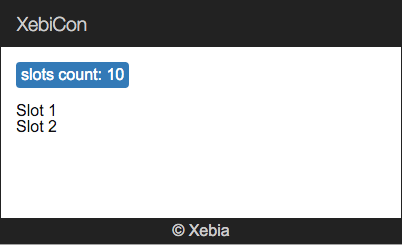

## First component

L'objectif de cet exercice est de créer notre propre component `xke-slots` qui contiendera la liste des slots.

Rappelez vous, chaque application Angular 2 est faite de composants qui forment une structure [arborescente](http://xebia-france.github.io/slot-angular2/#/3/1).
Voici une structure de notre future application :


 
_Info: Dans le fichier `app.ts` notez l'instruction [`bootstrap(App);`](https://angular.io/docs/js/latest/api/core/bootstrap-function.html). 
Cette ligne permet d'indiquer à Angular que le component `App` est un component `root`._  

### Création du composant `xke-slots` :

- créez le fichier `src/xke-slots.ts`
- créez le component `XkeSlots` - voir `app.ts` pour l'example (sans `bootstrap(App);` bien sûr !) 
  - selector: `xke-slots`
  - template [externe](http://xebia-france.github.io/slot-angular2/#/3/5): `xke-slots.html`
- créez le fichier de template :

**xke-slots.html :**

```html
<p>
  slots count: 10
</p>

<ul>
  <li>
      Slot 1
  </li>
  <li>
      Slot 2
  </li>
</ul>
```
  
> Felicitation, votre nouveau component est prêt !

### Utilisation :

Il ne reste qu'à utiliser notre nouveau component dans le component root: `App`

Pour cela dans `app.ts`:

- supprimez tout le contenu de template sauf la balise `header`
- ajoutez la nouvelle balise correspondante au composant `XkeSlots` 
- il faut [importer](https://developer.mozilla.org/en-US/docs/Web/JavaScript/Reference/Statements/import) le nouveau composant 
et le declarer dans le [`@View`](https://angular.io/docs/js/latest/api/annotations/ComponentAnnotation-class.html) du `App` (utilisez l'attribut `directives`)


A la fin de cette étape votre application doit ressembler à ça :


 

[Solution](2-first-component-solution.md)

[< Prev](1-data-binding.md) [Next >](3-store-service.md)
