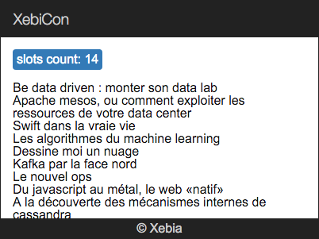

## Service

Le but de cet exercice est de créer un service `StoreService` qui va fournir une liste de slots, ainsi que d'afficher les titres de chaque slot.

> Commençons par la fin - affichage les slots :)

Voici la structure [json](3-store-service-json.md) des slots à utiliser.

### For directive

- dans le component XkeSlots ajoutez une methode `getSlots()` retournant directement le [json](3-store-service-json.md)
- dans le template de ce même component [itérez](https://angular.io/docs/js/latest/api/directives/NgFor-class.html) sur `getSlots()` (sur la balise `li`) et affichez le title de chaque slot (`slot.title`)
- attention, n'oubliez pas [d'importer](https://developer.mozilla.org/en-US/docs/Web/JavaScript/Reference/Statements/import) la class `NgFor` dans la fichier `xke-slots.js` ainsi que le declarer dans le `@View` de component XkeSlots. Pour plus d'info, voir [NgFor](https://angular.io/docs/js/latest/api/directives/NgFor-class.html)
- finalement, affichez le nombre de slots dans la balise `p`

Votre application doit apparenter ceci :

  
  
### Service injectable

Pour les raisons évidantes, il n'est pas acceptable de laisser les données hard-codées dans le component ;).
Créons un service qui aura pour but de nous les fournir (pour l'instant toujours hard-codées).

- créez le fichier `store-service.js`
- declarez-y une classe `StoreService` (n'oubliez pas de l'[exporter](https://developer.mozilla.org/en-US/docs/Web/JavaScript/Reference/Statements/export))
- implementez la méthode  `getSlots()` qui retournera le fameux [json](3-store-service-json.md)

Voila, notre Service est prêt !

Utilisons le :

- dans le component `XkeSlots`, [importez](https://developer.mozilla.org/en-US/docs/Web/JavaScript/Reference/Statements/import) le nouveau service
- configurez [l'injecteur](https://angular.io/docs/js/latest/api/annotations/ComponentAnnotation-class.html) dans le decorateur `@Component`:  `appInjector: [StoreService]`   
- dans le constructeur, injectez le nouveau service par son type: `constructor(storeService:StoreService) { ... }`
- utilisez le dans la méthode `XkeSlots.getSlots()` 

[Solution](3-store-service-solution.md)

[< Prev](2-first-component.md) [Next >](4-slot-component.md)
