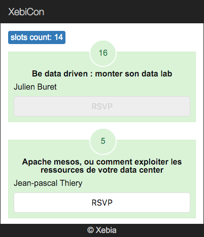

## Slot component

L'objectif de cette partie est de créer un 'child' component `xke-slot` et lui passer le model de slot à afficher.

Pour vous rappeler la structure :


### Etapes : 

- créez le fichier `xke-slot.js`
- placez-y le nouveau component `XkeSlot`
  - selector: `xke-slot` (@Component)
  - templateUrl: `xke-slot.html` (@View)

**xke-slot.html :**

```html
<div class="count">
  <div>8</div>
</div>

<div class="title">Slot title</div>

<ul>
  <li>Speaker 1</li>
  <li>Speaker 2</li>
</ul>

<button>RSVP</button>
```


Utiliser ce component dans le template de XkeSlots (`xke-slots.html`) à la place de titre dans la balise &lt;li&gt;:

- n'oubliez pas de l'importer dans le `xke-slots.js` et de le déclarer dans @View `directives: []`.


_Pour l'instant le nouveau component n'a pas d'accès au Model d'un slot. Fixons ça !_

### Component properties [] :

- déclarez le propriété `model` du component `XkeSlot` dans son `@Component` :

```typescript
@Component({
    selector: 'xke-slot',
    properties: ['model']
})
```

- dans le template de XkeSlots (`xke-slots.html`) passez le `slot` dans le propriété `model` du &lt;xke-slot&gt; (utilisez les crochets)  
- 'dynamisez' le template du component `XkeSlot` :
  - model.title
  - model.attendees
  - model.speakers (utiliser ng-for)
  
### Component behaviour :

Implementez le comportement du click sur le bouton RSVP :
- au click, appelez la méthode `rsvp()`
- implementez la méthode
  - incrementez le nombre d'attendées: `model.attendees`
  - une fois cliqué, il faut désactiver le bouton (rappelez vous comment écrire directement dans les [proprietés](http://www.w3schools.com/tags/att_input_disabled.asp)  d'un élément html) 


## Résultat

> Votre application doit ressembler à ça :


  
  
[Solution](4-slot-component-solution.md)

[< Prev](3-store-service.md) [Next >](5-filter-component.md)
