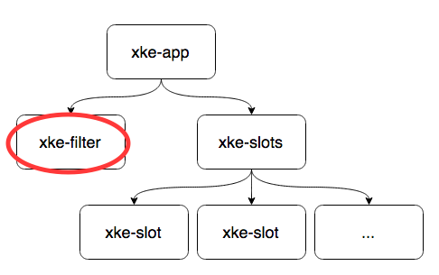
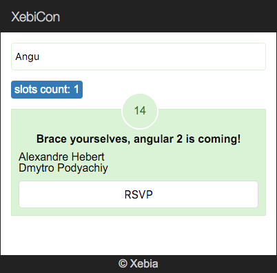

## Filter component

L'objectif de cette partie est de créer un component `xke-filter` permettant de filtrer le slots. 
Pour cela il nous faudra faire communiquer deux components frères.

Component `xke-filter` est positionné est tant que frère de component `xke-slots` :




### Component

Créez le component `XkeFilter` dans un nouveau fichier `xke-filter.js` :
- selector: `xke-filter`
- templateUrl: `xke-filter.html`
  
**xke-filter.html :**

```html
<input type="text" placeholder="Filter slot..." />
```

Utilisez `xke-filter` dans le component App (`app.js`) en le plaçant juste avant &lt;xke-slots&gt;


### Communication

Pour pouvoir communiquer avec le `xke-slots`, notre nouveau component doit émettre un événement (api output) 
dont la valeur sera ensuite tarnsmise à `xke-slots`.

**> communication de XkeFilter vers App :**

Ecoutez la saisie du filtre au `keyup` :
- au `keyup` sur &lt;input&gt; appelez une méthode `doFilter()`
- utilisez une référence `#...` pour passer une valeur d'&lt;input&gt; à `doFilter(...)`
- ajoutez une méthode `doFilter(...)` et vérifiez à l'aide de `console.log()` que tout marche comme sur des roulettes

Lancez un événement `filter` vers le composant parent :
- dans le décorateur `@Component` ajoutez la propriété suivante: `events: ['filter']`
- dans la classe `XkeFilter` ajoutez la propriété `filter:EventEmitter = new EventEmitter();`. _N'oubliez pas d'importer EventEmitter depuis 'angular2/angular2'_

_Tip : l'émission d'un événement s'écrit sous cette forme `this.filter.next({value: ...});`_

**> communication de App vers XkeSlots :**

Normalement, vous avez toutes les connaissances nécessaires pour faire cette étape :-P  

_Tip: La valeur d'un événement remonté est accessible à `$event.value`_

Une fois que la valeur de filtre est recupérée dans `XkeSlots` vous pouvez filtrer la liste des slots.
[Voici](5-filter-component-filter-function.md) le code de filtrage pour gagner du temps.


## Résultat

> Vous devez obtenir un rendu qui s'apparente à ça :



  
[Solution](5-filter-component-solution.md)

[< Prev](4-slot-component.md) [Next >](6-fetch-data.md)
