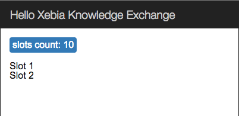

## First component

L'objectif de cet exercice est de créer notre propre component qui contiendera la liste des slots: `xke-slots`.

Rappelez vous, chaque application Angular 2 est faite de composants qui forment une structure arborescente.
Voici une structure de notre future application :


 
&oast; Dans le fichier `app.js` notez l'instruction [`bootstrap(App);`](https://angular.io/docs/js/latest/api/core/bootstrap-function.html). 
Cette ligne permet d'indiquer à Angular que le component `App` est un component `root`.  

### Créer component `xke-slots` :

- créer le fichier `src/xke-slots.js` et y re-copier le contenue de `app.js` (sans `bootstrap(App);` bien sûr !)   
- selector: `xke-slots`
- template externe: `xke-slots.html`

Le contenu de template statique `xke-slots.html`:

```html
<p>
  slots count: 10
</p>

<ul>
  <li>
      Slot 1
  </li>
  <li>
      Slot 2
  </li>
</ul>
```
  
> Felicitation, votre nouveau component est prêt !

### Utilisation :

Il ne reste qu'utiliser notre nouveau component dans le component root: `App`

Pour cela dans `app.js`:

- supprimer tout le contenue de template sauf la balise `header`
- ajouter la nouvelle balise correspondante au composant `XkeSlots` juste après
- il faut [importer](https://developer.mozilla.org/en-US/docs/Web/JavaScript/Reference/Statements/import) le nouveau composant 
et le declarer dans le [decorateur `@View`](https://angular.io/docs/js/latest/api/annotations/ComponentAnnotation-class.html) du `App` (utilisez l'attribut `directives`)


A la fin de cette étape votre application doit ressembler à ça :


 
  
[Solution](first-component-solution.md)

[< Prev](data-binding.md) [Next >](store-service.md)
