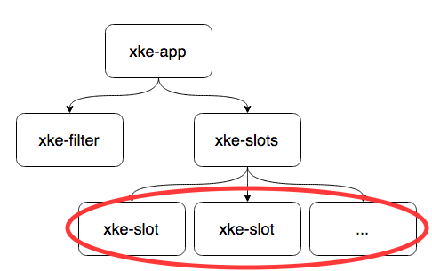
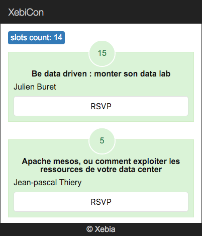

## Slot component

L'objectif de cette partie est de créer un 'child' component `xke-slot` et lui passer le model de slot à afficher.

Pour vous rappeler la structure :



### Etapes : 

- créez le fichier `xke-slot.js`
- placez-y le nouveau component `XkeSlot`
  - selector: `xke-slot` (@Component)
  - templateUrl: `xke-slot.html` (@View)

Utiliser ce component dans le template de XkeSlots (`xke-slots.html`) à la place de titre dans la balise `li`:

- n'oubliez pas de l'importer et de le declarer dans le `xke-slots.js`.


Pour l'instant le nouveau component n'as pas d'accès au model d'un slot. 

### Component properties [] :

- declarer le propriété `model` du component `XkeSlot` dans son `@Component` :
```typescript
@Component({
    selector: 'xke-slot',
    properties: ['model']
})
```
- dans le template de XkeSlots (`xke-slots.html`) passer le `slot` dans le propriété `model` du &lt;xke-slot&gt; (utilisez les crochées)  
- finalizer le template du component `XkeSlot`
  - model.title
  - model.attendees
  - model.speakers (utiliser ng-for)
  

Votre application doit d'approcher à ça:


  
[Solution](slot-component-solution.md)

[< Prev](store-service.md) [Next >](slot-component.md)
