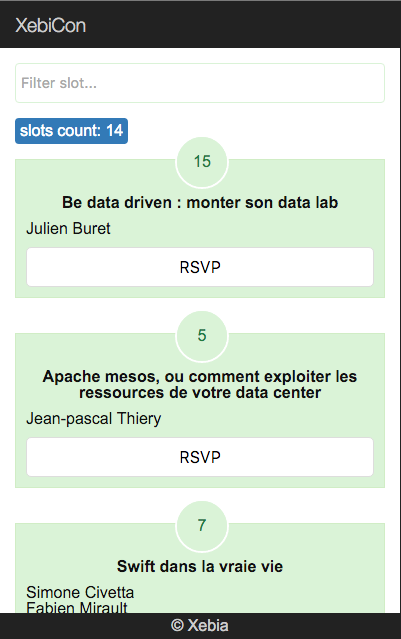

# Workshop > Angular2

## Sujet

> Le but de ce workshop est de construire une simple application pour RSVP des slots XebiCon en utilisant Angular2.
> 
> avec:
> - affichage de la liste des slots avec le nombre de RSVP 
> - recherche de slots
> - button RSVP pour chaque slot

###Le resultat final :

[Commencer l'exercice >](0-getting-started.md)

